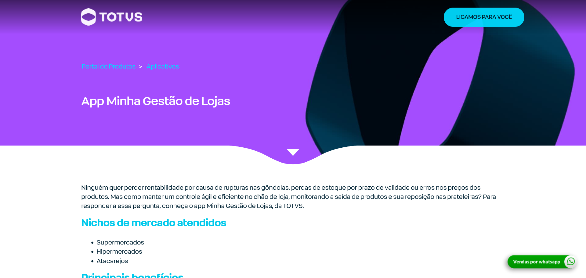
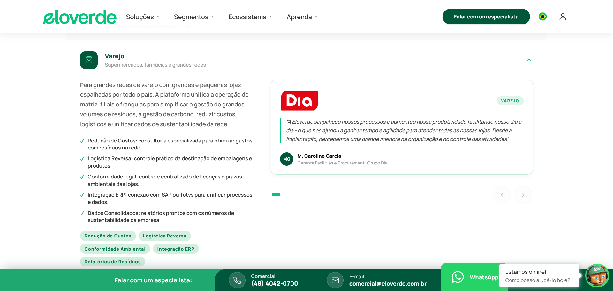
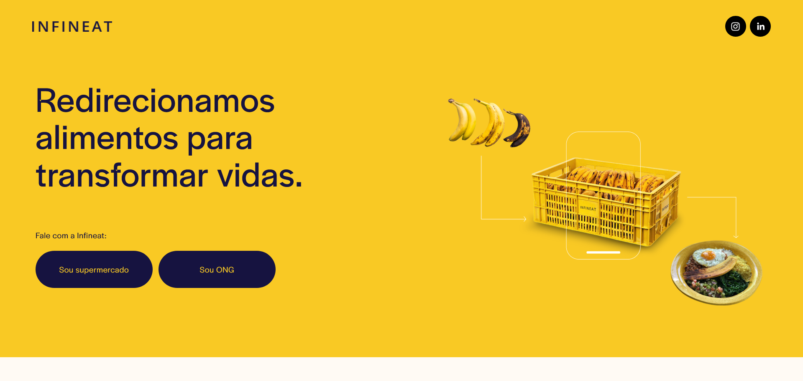
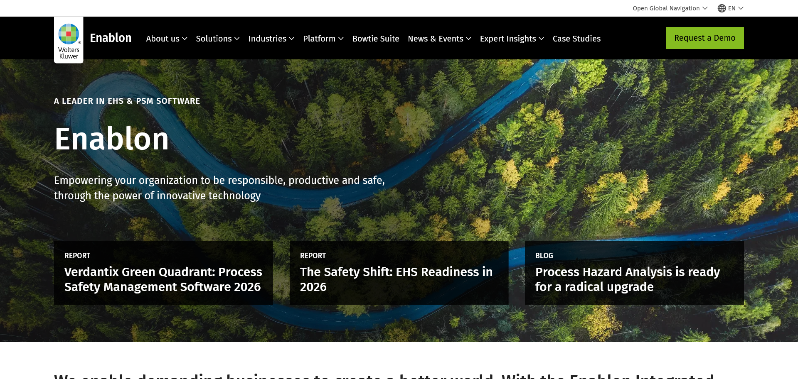
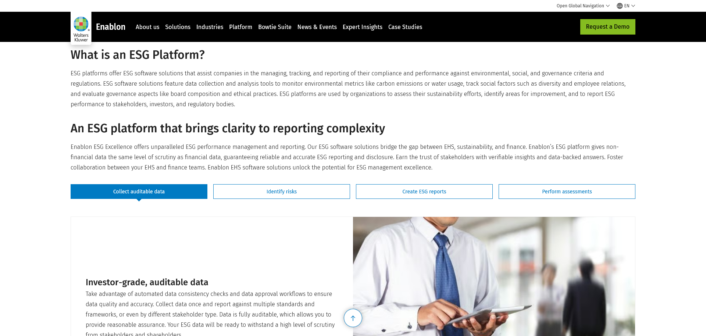
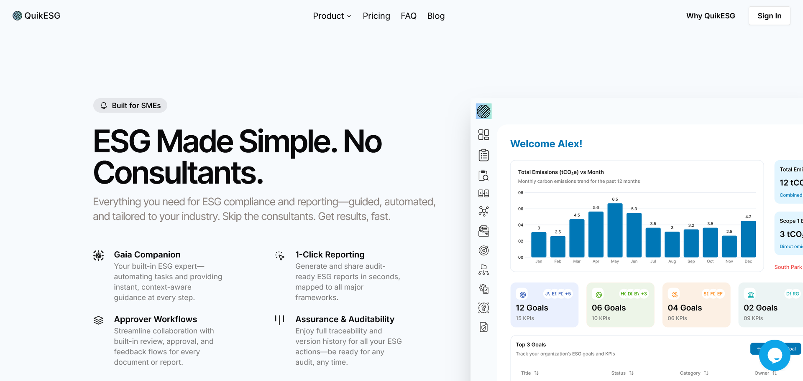
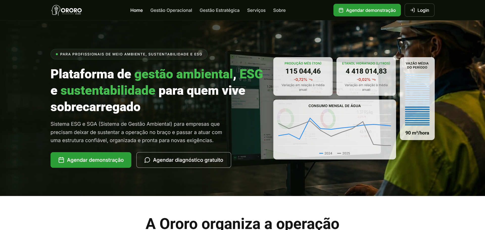
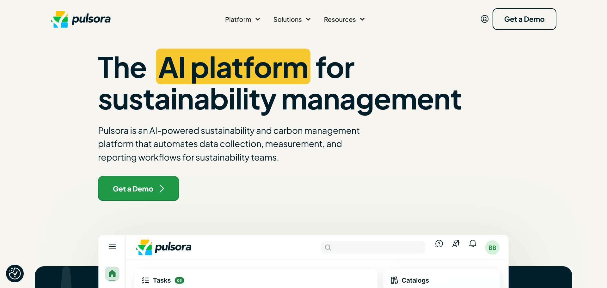
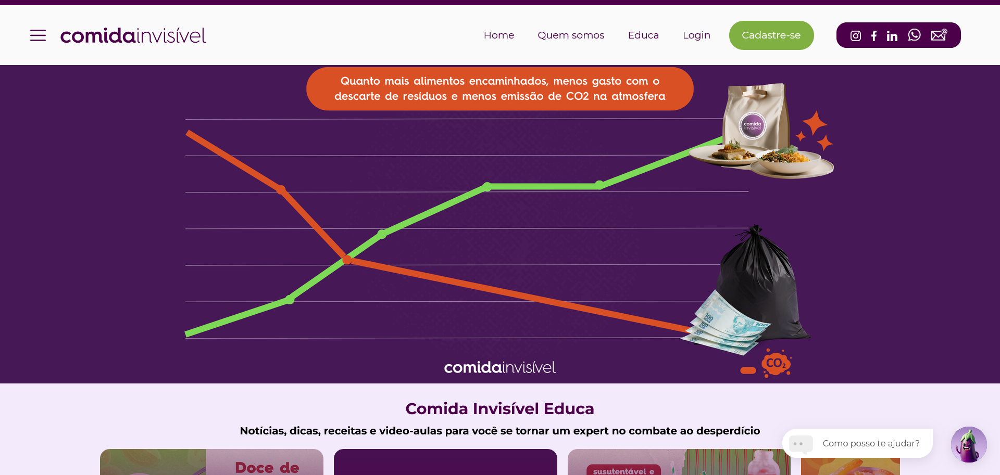
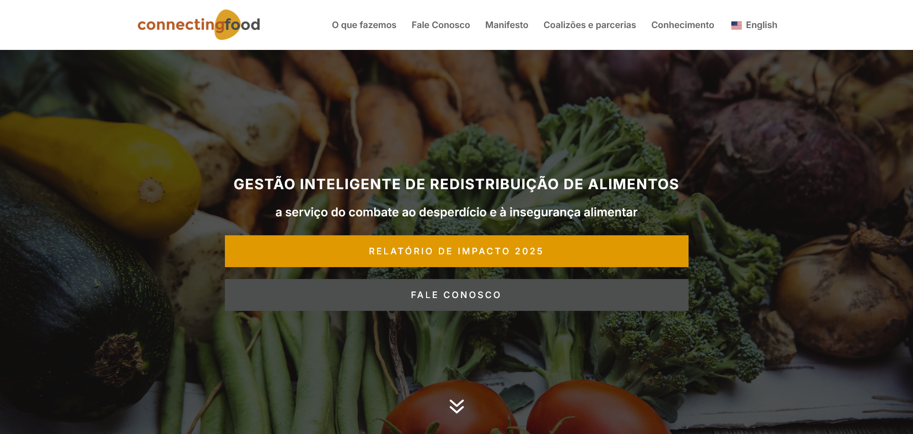

## 1. Introdução

&emsp;&emsp;O propósito deste documento é realizar um levantamento mercadológico e de tecnologias similares para identificar oportunidades de inovação e evitar "reinventar a roda" no setor varejista. O escopo abrange a análise de soluções que lidam com a adoção de práticas ESG (Ambiental, Social e Governança). O projeto sendo desenvolvido visa auxiliar pequenos e médios supermercados (PMEs) a superarem obstáculos como a falta de conhecimento sobre ESG, escassez de recursos e coleta manual de dados. Os produtos analisados foram: TOTVS (Minha gestão de lojas), EloVerde, Infineat, Enablon e QuikESG.

## 2. Produtos analisados

### 2.1 Produto A: TOTVS (Minha gestão de lojas)

####	2.1.1 Visão geral
&emsp;&emsp;É uma aplicação que atua como facilitadora na digitalização da gestão das empresas, seu público-alvo inclui o setor varejista supermercadista. O propósito inclui o gerenciamento de estoque, perdas, tarefas e gestão de compras.

####	2.1.2 Funcionamento

&emsp;&emsp;O sistema possibilita a geração, gestão e visualização de tarefas do mercado. 

A plataforma ajuda a eliminar divergências de dados e reduzir a perda de produtos pelo vencimento.

####	2.1.3 Pontos fortes
&emsp;&emsp;Otimiza o controle de perdas e validade, e permite a digitalização robusta de processos internos e gestão de compras.

####	2.1.4 Pontos fracos
&emsp;&emsp;Complexidade alta, possuindo muitas funcionalidades difíceis de entender e configurar. Os custos não ficam claros inicialmente, o que pode assustar empresários iniciantes. Apresenta baixa percepção de retorno imediato para o usuário.

###    2.2 Produto B: EloVerde

####	2.2.1 Visão geral
&emsp;&emsp;Trata-se de uma plataforma que integra as áreas de sustentabilidade em um único ecossistema. Seu propósito é criar soluções especializadas para cada setor, auxiliando desde a aprendizagem sobre ESG até o gerenciamento prático.

####	2.2.2 Funcionamento
&emsp;&emsp;O sistema apresenta uma visão completa e individualizada das métricas de sustentabilidade da empresa no dia a dia.

####	2.2.3 Pontos fortes
&emsp;&emsp;Oferece uma visão unificada e especializada para as áreas de sustentabilidade corporativa.

####	2.2.4 Pontos fracos
&emsp;&emsp;A interface é considerada "poluída" pelo excesso de informações. Os dados ficam descentralizados e se tornam uma carga cognitiva confusa sem a devida interpretação. O fluxo de ações é dificultado pela complexidade de configuração.

### 2.3 Produto C: Infineat

####	2.3.1 Visão geral
&emsp;&emsp;É uma plataforma simples que atua como um conector entre supermercados e ONGs. Seu público-alvo direto são negócios que lidam com alimentos e instituições de caridade. O propósito é promover a doação de comidas que seriam descartadas devido à validade.

####	2.3.2 Funcionamento

&emsp;&emsp;O sistema identifica alimentos próximos ao vencimento e facilita o redirecionamento para doação a ONGs.

####	2.3.3 Pontos fortes

&emsp;&emsp;Oferece uma solução simples que ataca diretamente o problema ambiental (descarte incorreto) e social (fome), além de evitar prejuízos financeiros maiores.

#### 2.3.4 Pontos fracos

&emsp;&emsp;Foco restrito apenas à gestão de resíduos alimentares/doações, não cobrindo os demais aspectos e métricas complexas de Governança e emissões globais de ESG apontadas no contexto do mercado.

### 2.4 Produto D: Enablon

<!--  -->

#### 2.4.1 Visão geral
&emsp;&emsp;É uma plataforma de software voltada para consultoria de métricas e normas ESG. Seu público-alvo são, em geral, grandes empresas e corporações contratantes. O propósito é fornecer um acompanhamento profundo sobre as normas ESG.

#### 2.4.2 Funcionamento
&emsp;&emsp;Apresenta detalhamentos e métricas avançadas sobre práticas corporativas baseadas em normas globais ESG.

#### 2.4.3 Pontos fortes
&emsp;&emsp;É um sistema extremamente completo que serve como modelo de referência em termos de normas e auditoria ESG no mercado.

#### 2.4.4 Pontos fracos
&emsp;&emsp;Apresenta uma interface com termos técnicos e jargões de difícil entendimento. O modelo de consultoria é muito caro e estruturalmente distante da realidade tecnológica e financeira de pequenos negócios.

### 2.5 Produto E: QuikESG

#### 2.5.1 Visão geral
&emsp;&emsp;É uma aplicação web projetada para automatizar e agilizar a elaboração de relatórios de ESG.

#### 2.5.2 Funcionamento
&emsp;&emsp;A ferramenta utiliza Inteligência Artificial (IA) para processar documentos enviados pelos usuários e fornecer insights. Ela ajuda os usuários a responder rapidamente a questionários de ESG.

#### 2.5.3 Pontos fortes
&emsp;&emsp;Automatiza processos manuais de relatório. Utiliza IA para processamento de informações e geração ágil de insights operacionais.

#### 2.5.4 Pontos fracos 
&emsp;&emsp;Soluções baseadas unicamente em relatórios não resolvem o gargalo da coleta primária de dados estruturados diretamente da operação física dos supermercados.

### 2.6 Produto F: Ororo

#### 2.6.1 Visão geral
&emsp;&emsp;É uma empresa brasileira que funciona no modelo B2B, desenvolvendo softwares para para outras empresas, dos mais variados ramos, com o objetivo de centralizar, organizar e acompanhar informações relacionadas a ESG, sustentabilidade e gestão.

#### 2.6.2 Funcionamento
&emsp;&emsp;A empresa cadastra suas informações na plataforma, e a Ororo organiza, relaciona e acompanha as metas e atualizações, gerando relatorios sobre sustentabilidade e ESG. 

#### 2.6.3 Pontos fortes
&emsp;&emsp;Centraliza , organiza e automatiza o controle de dados ESG, deixando mais fácil a leitura e compreensão dos relatórios.

#### 2.6.4 Pontos fracos 
&emsp;&emsp;Não é possivel saber o preço previamente, sendo necessário negociar diretamente com a empresa para saber e depende totalmente das informações disponibilizadas pelo cliente.

### 2.7 Produto G: Pulsora

#### 2.7.1 Visão geral
&emsp;&emsp;A Pulsora densenvolve um software B2B, que substitui processos manuais fragmentados por um ecossistema digital que realiza contabilidade de carbono, consolida métricas não financeiras e gera relatórios de conformidade.

#### 2.7.2 Funcionamento
&emsp;&emsp;O software atua como o sistema nervoso central do ESG da empresa e opera em quatro etapas, na coleta integrada e automatizada de dados, se conectando a sistemas de coleta já existentes, no tratamento e validação desses dados utilizando IA, na trilha de auditoria contínua por meio de um change log e facilitando a visualização desses dados, por meio de gráficos e relatórios gerados automaticamente.

#### 2.7.3 Pontos fortes
&emsp;&emsp; Adaptação constante a novas leis climáticas, centralização e tratamento de dados, além de uma facilitar a vizualição desses, e transparência na proveniência desses.

#### 2.7.4 Pontos fracos
&emsp;&emsp; O preço é muito caro para as PMEs brasileiras, sendo esse entre US$ 15k a US$ 40k, podendo ultrapassar US$ 250k anualmente, dependência da qualidade do dado base, depende muito da qualidade da tecnologia usada para conseguir o dado por mais que a IA consiga identificar anomalias e complexidade de implementação.

### 2.8 Produto H: Comida Invisível

#### 2.8.1 Visão geral
&emsp;&emsp;A Comida Invisível é uma startup brasileira que atua como um hub de impacto social, conectando pequenos e médios supermercados que possuem alimentos próximos ao vencimento diretamente a ONGs, gerando métricas ESG no processo.

#### 2.8.2 Funcionamento
&emsp;&emsp;O funcionário do varejo utiliza a plataforma para cadastrar produtos perto da validade, com avarias na embalagem ou fora do padrão estético. O sistema usa geolocalização para notificar ONGs parceiras locais, que fazem a reserva e a coleta. As doações são automaticamente convertidas em dados e relatórios de impacto ambiental e social (ESG) para a empresa.

#### 2.8.3 Pontos fortes
&emsp;&emsp;Possui foco total em PMEs (baixo custo/acessibilidade) e uma interface de uso muito simples (baixa carga cognitiva). Combate o desperdício de forma prática, automatiza a geração de relatórios ESG (como refeições geradas e carbono evitado) e possui forte conexão com causas sociais.

#### 2.8.4 Pontos fracos
&emsp;&emsp;Atua exclusivamente com foco em doação (repasse filantrópico). Diferente do "Nosso Projeto", não oferece uma esteira prévia de recuperação financeira (como colocar o item em promoção nos dias anteriores) para ajudar o varejista a recuperar parte do custo do produto antes de doá-lo.

### 2.9 Produto I: Connecting Food

#### 2.9.1 Visão geral
&emsp;&emsp;A Connecting Food é uma foodtech brasileira de impacto social que conecta alimentos excedentes do varejo (que perderiam valor comercial) a organizações sociais, gerando dados ESG de forma automatizada.

#### 2.9.2 Funcionamento
&emsp;&emsp;O supermercado utiliza a plataforma para cadastrar produtos próximos ao vencimento, com avarias ou fora do padrão estético. A tecnologia da Connecting Food orquestra a logística, direcionando esses alimentos para ONGs validadas na região. Todo o volume doado é convertido em dashboards com métricas de impacto (refeições complementadas, emissões de CO2 evitadas).

#### 2.9.3 Pontos fortes
&emsp;&emsp;Democratiza o ESG para o varejo, possui interface simplificada e combate o desperdício na prática. A automação da geração de relatórios de impacto e a forte conexão com causas sociais são seus maiores destaques, atendendo muito bem às demandas de compliance.

#### 2.9.4 Pontos fracos
&emsp;&emsp;Assim como a Comida Invisível, o modelo é focado 100% no repasse filantrópico (doação), sem um módulo focado em ajudar o pequeno lojista a vender o produto com desconto primeiro. Além disso, costuma focar um pouco mais no grande varejo (grandes redes supermercadistas) do que nos pequenos mercados de bairro.

## 3. Benchmark

| Funcionalidade / Característica | TOTVS | EloVerde | Infineat | Enablon | QuikESG | Ororo | Pulsora | Comida Invisível | Connecting Food | **Nosso Projeto** |
| :--- | :---: | :---: | :---: | :---: | :---: | :---: | :---: | :---: | :---: | :---: |
| **Foco em PMEs (Baixo Custo/Acessibilidade)** | Não | Média | Sim | Não | Média | Não | Não | Sim | Sim | Sim |
| **Gestão e Combate ao Desperdício (Validade)** | Sim | Não | Sim | Não | Não | Sim | Não | Sim | Sim | Sim |
| **Integração/Automação de Relatórios ESG** | Não | Sim | Não | Sim | Sim | Sim | Sim | Sim | Sim | Sim |
| **Baixa Complexidade/Carga Cognitiva (UX)** | Não | Não | Sim | Não | Média | Média | Não | Sim | Sim | Sim |
| **Foco em Conexão Social (Ex: ONGs)** | Não | Não | Sim | Não | Não | Não | Não | Sim | Sim | Sim  |

## 4. Requisitos obtidos

**[Requisito Positivo - Funcionalidade de Integração]:** O sistema deve ser capaz de integrar dados de APIs externas de delivery (como a Merchant API e Analytics API do iFood) e cruzá-los com o estoque interno, gerando algoritmos de análise de demanda para prever histórico de compra/venda e reduzir o desperdício de alimentos.  

**[Requisito Negativo - Usabilidade e Design]:** A interface do usuário não deve apresentar painéis estáticos com excesso de informação e jargões técnicos ("poluição visual") que gerem carga cognitiva alta. O sistema deve proibir a exibição de dados de forma descentralizada e sem interpretação, devendo apresentar os dados traduzidos através de storytelling ou gráficos animados, facilitando o uso por pessoas com baixa literacia digital.  

**[Requisito Positivo - Regra de Negócio/Ambiental]:** O sistema deve possuir um mecanismo de notificação automatizado para alertar sobre o vencimento próximo de alimentos, viabilizando e sugerindo ações corretivas práticas, como o encaminhamento para doação a ONGs, visando a redução de perdas financeiras e o impacto sustentável positivo.  

**[Requisito Negativo - Arquitetura de Dados]:** O sistema não deve depender de coleta e inserção de dados puramente manual ou em planilhas não estruturadas por parte dos usuários (gargalo crítico das PMEs). A arquitetura deve estruturar automaticamente dados financeiros e ambientais para facilitar a geração de indicadores compatíveis com APIs modernas de mensuração ESG. 

